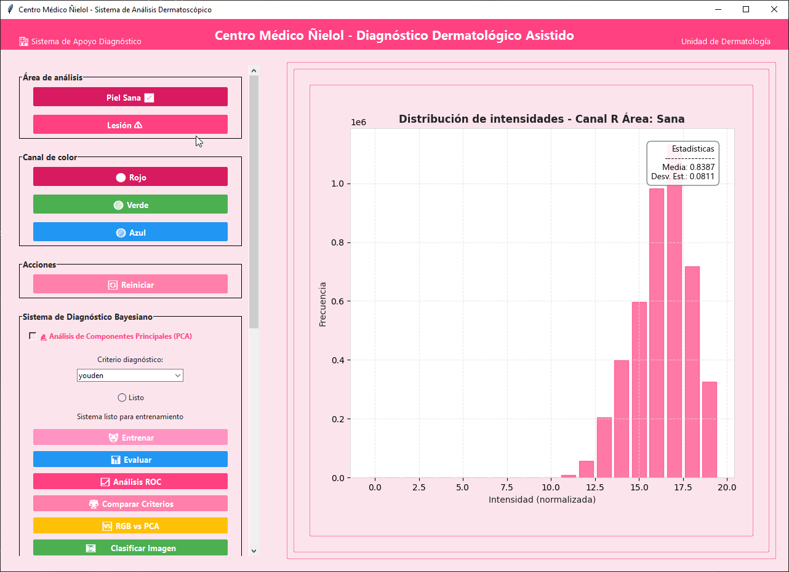
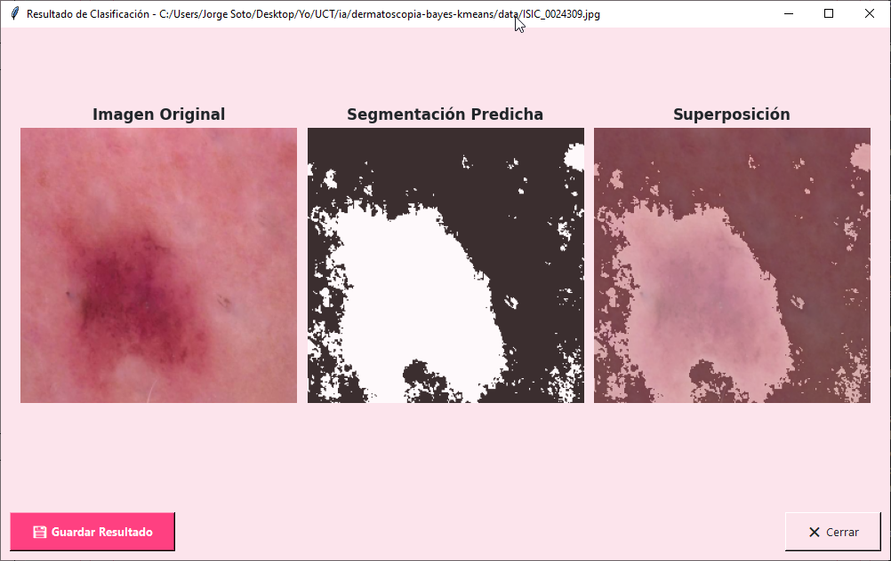
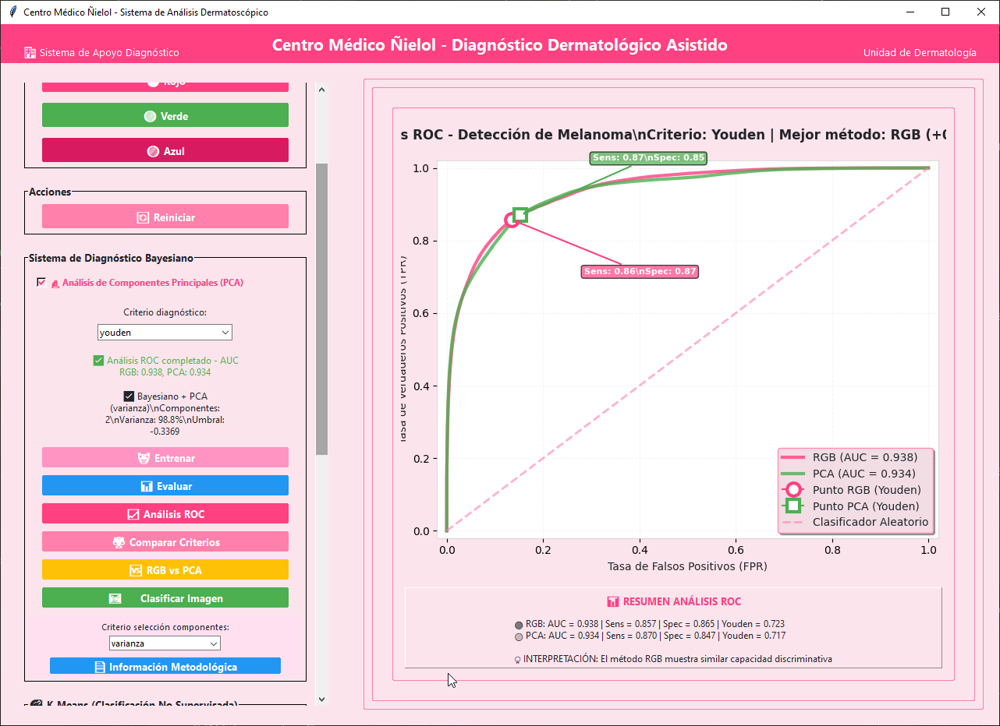
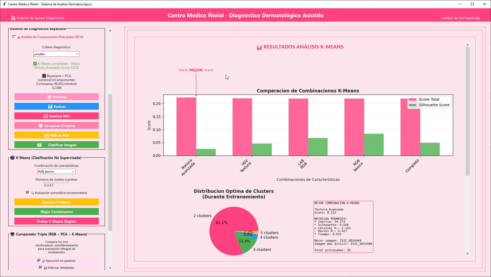
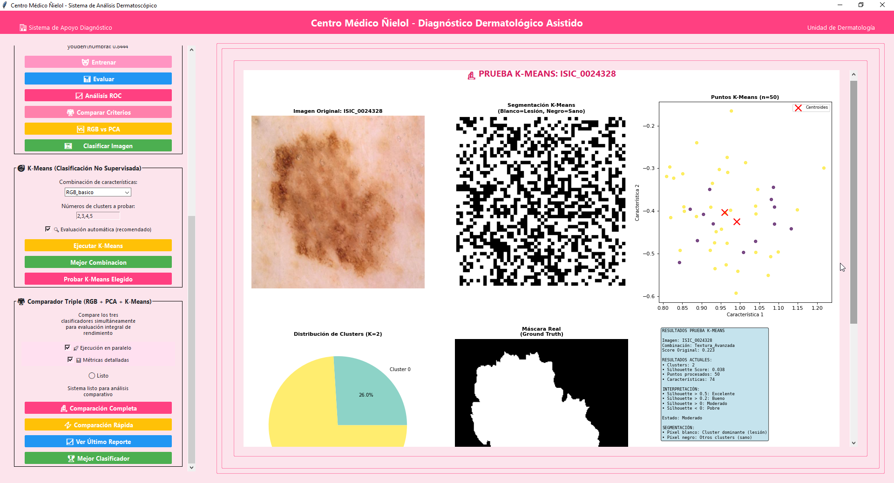

# Dermatoscopia Bayes-KMeans

<div align="center">
   
</div>

Este proyecto implementa una aplicación para segmentar lesiones en imágenes de dermatoscopía usando inteligencia artificial. Permite comparar distintos métodos de clasificación de píxeles: Bayesiano RGB, Bayesiano con PCA y K-Means.

## Objetivo

Desarrollar una herramienta que ayude a diferenciar entre regiones de lesión y no-lesión en imágenes de piel, facilitando el apoyo al diagnóstico médico.


## ¿Qué hace la aplicación?
- Carga imágenes y máscaras de referencia.
- Extrae características de color y/o textura de cada píxel.
- Permite entrenar y comparar:
   - Clasificador Bayesiano RGB
   - Clasificador Bayesiano con reducción de dimensionalidad (PCA)
   - Algoritmo no supervisado K-Means
- Muestra resultados y métricas de segmentación (exactitud, precisión, sensibilidad, etc.)
- Visualiza las segmentaciones obtenidas y las compara con la referencia.

<div align="center">
   
</div>
<sub>Al usar el botón <b>Probar imagen</b>, la aplicación genera una segmentación predicha usando el modelo bayesiano entrenado actual, permitiendo visualizar el resultado sobre una imagen específica.</sub>

## Uso rápido

1. Instala dependencias:
   ```bash
   pip install -r requirements.txt
   ```
2. Ejecuta la aplicación:
   ```bash
   python src/main.py
   ```


## Estructura básica

- `src/` Código fuente principal
- `data/` Imágenes y máscaras
- `requirements.txt` Dependencias

---


## 📸 Galería de Imagenes

<div align="center">
   
   <br>
   <sub>Comparación de curvas ROC para los clasificadores Bayesiano RGB y PCA, mostrando la capacidad discriminativa y los valores de AUC obtenidos.</sub>
   <br><br>
   
   <br>
   <sub>Visualización de los clusters obtenidos tras entrenar el algoritmo K-Means, mostrando la segmentación automática en regiones principales.</sub>
   <br><br>
   
   <br>
   <sub>Resultados de métricas de segmentación obtenidas con K-Means, evaluando la calidad y robustez de la segmentación.</sub>
</div>


## 👥 Autores

<div align="center">
   <table>
      <tr>
         <td align="center">
            <br>
            <b>Jorge Soto</b><br>
            <a href="https://github.com/Linich14">@Linich14</a>
         </td>
         <td align="center">
            <br>
            <b>Daniel Peña</b><br>
            <a href="https://github.com/DPBascur">@DPBascur</a>
         </td>
      </tr>
   </table>
</div>

---
Proyecto académico. Uso educativo y de experimentación.


